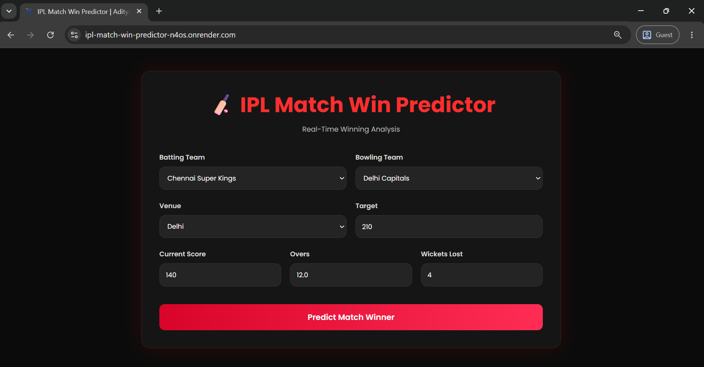
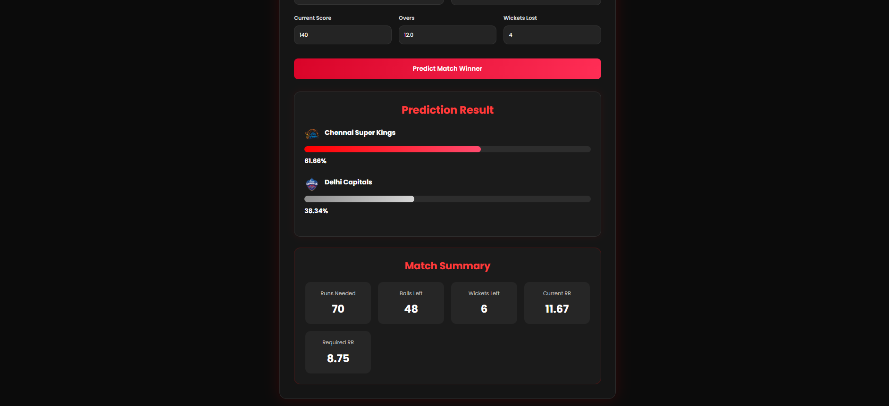
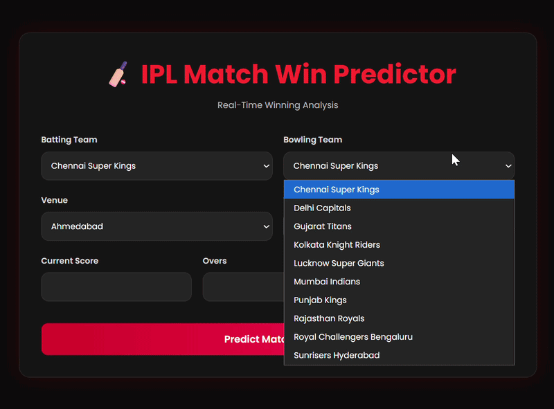

# IPL Match Win Predictor

A production-ready Machine Learning web application that predicts the winning probability of the chasing team during the second innings of an IPL match based on the live match situation.

**Live Demo:** https://ipl-match-win-predictor-n4os.onrender.com

---

## Overview

IPL Match Win Predictor estimates the probability of victory for both teams during a run chase using a trained Machine Learning pipeline.

The application takes the current match situation—including teams, venue, score, target, overs, and wickets—and generates real-time winning probabilities along with useful match statistics.

The project is built with Flask, Scikit-Learn and deployed on Render.

---

## Features

- Real-time IPL win probability prediction
- Machine Learning prediction pipeline
- Probability visualization for both teams
- Team logo integration
- Match summary dashboard
- Runs Required calculation
- Current Run Rate (CRR)
- Required Run Rate (RRR)
- Balls Remaining
- Wickets Remaining
- Responsive dark-themed interface
- Production deployment on Render

---

## Live Demo

https://ipl-match-win-predictor-n4os.onrender.com

---

## Screenshots

### Home Page

<p align="center">

</p>

---

### Prediction Result

<p align="center">

</p>

---

### Project Demo

<p align="center">

</p>

---

## Tech Stack

### Backend

- Python
- Flask
- Jinja2

### Machine Learning

- Scikit-Learn
- Pandas
- NumPy

### Frontend

- HTML5
- CSS3

### Deployment

- Render
- Gunicorn

---

## Machine Learning Workflow

```
Historical IPL Dataset
        │
        ▼
Data Cleaning
        │
        ▼
Feature Engineering
        │
        ▼
Preprocessing Pipeline
        │
        ▼
Logistic Regression Model
        │
        ▼
Probability Prediction
        │
        ▼
Flask Web Application
```

---

## Application Workflow

```
User Input
     │
     ▼
Feature Engineering
     │
     ▼
Scikit-Learn Pipeline
     │
     ▼
Win Probability Prediction
     │
     ▼
Interactive Dashboard
```

---

## Input Parameters

The model predicts match outcome using:

- Batting Team
- Bowling Team
- Venue
- Target Score
- Current Score
- Overs Completed
- Wickets Lost

From these inputs, the application computes additional match features including:

- Runs Left
- Balls Left
- Wickets Remaining
- Current Run Rate
- Required Run Rate

before generating the final prediction.

---

## Project Structure

```
IPL_Match_Predictor/
│
├── static/
│   ├── logos/
│   ├── favicon.png
│   └── style.css
│
├── templates/
│   └── index.html
│
├── assets/
│   ├── demo.gif
│   ├── home.png
│   └── prediction.png
│
├── app.py
├── pipe.pkl
├── Match.csv
├── Delivery.csv
├── requirements.txt
├── ProcFile
└── README.md
```

---

## Getting Started

### Clone the repository

```bash
git clone https://github.com/adityag1507/IPL-Match-Win-Predictor.git
```

### Navigate to the project

```bash
cd IPL-Match-Win-Predictor
```

### Install dependencies

```bash
pip install -r requirements.txt
```

### Run the application

```bash
python app.py
```

### Open in browser

```
http://127.0.0.1:5000
```

---

## Deployment

The application is deployed on **Render** using **Gunicorn** as the production WSGI server.

During deployment, multiple production issues were resolved, including:

- Python runtime compatibility
- Dependency version conflicts
- Scikit-Learn model serialization compatibility
- Production deployment configuration
- Requirements management

---

## Future Enhancements

- Support latest IPL seasons
- Live match API integration
- Player statistics
- Interactive analytics dashboard
- Match momentum visualization
- Win probability progression graph
- Team performance insights

---

## Repository

GitHub Repository

https://github.com/adityag1507/IPL-Match-Win-Predictor

---

## Author

**Aditya Goyal**

GitHub

https://github.com/adityag1507

LinkedIn

https://www.linkedin.com/in/aditya-goyal-14161b402

---
